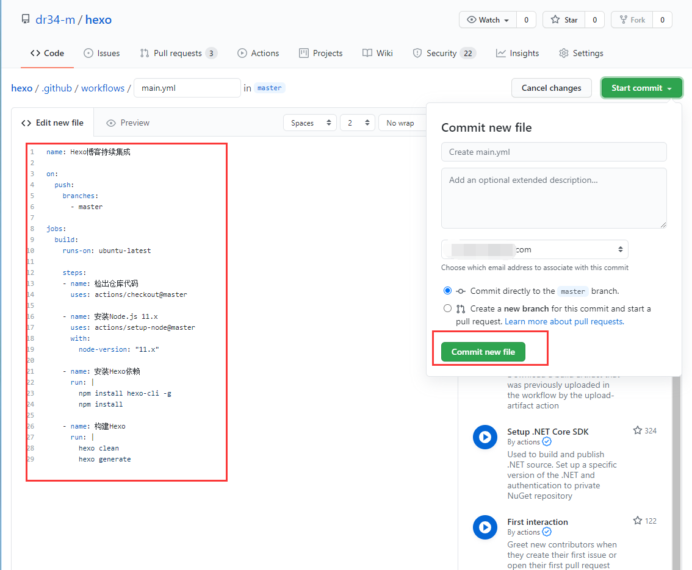
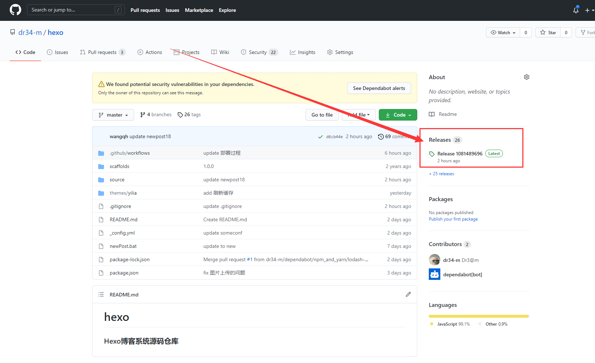

# 最终成果

编写文章后只需提交代码，之后自动构建hexo生成public文件夹，并自动将其发布到你需要的平台，还可以自动生成release用于存档，方便随时回滚到过去任意一版博客。

<!--more-->

**本文要求已经对Hexo有一点了解，并且知道怎么把hexo源码放到github，如果您刚接触Hexo，可以参考[Hexo安装配置并托管至github](/2017/12/post233/)**

**如果不想依赖github，可以参考这套自建方案[centos下hexo + svn + jenkins实现博客自动部署](/2020/11/post249/)、[svn提交后jenkins自动部署](/2020/11/newpost-1/)**

# 实现过程

## 一、新建仓库存放Hexo源码

如果有了就不用新建，这里存放的是hexo源码，可以公开也可以私有，具体方法不赘述。

## 二、创建Github Actions实现自动构建Hexo得到public

* 进入仓库Actions-new workflow


* set up a workflow yourself


* 编辑如下后提交保存，其中Node版本可以自己修改

```yml
name: Hexo博客持续集成

on: 
  push:
    branches:
      - master
      
jobs:
  build: 
    runs-on: ubuntu-latest 

    steps:
    - name: 检出仓库代码
      uses: actions/checkout@master

    - name: 安装Node.js 11.x 
      uses: actions/setup-node@master
      with:
        node-version: "11.x"

    - name: 安装Hexo依赖
      run: |
        npm install hexo-cli -g
        npm install

    - name: 构建Hexo
      run: |
        hexo clean
        hexo generate
```



## 三、发布到你想要发布的地方（以下几种方式选一即可，也可多选）

### 3.1 发布到云服务器（以下几种方式选一即可）

#### 3.1.1 通过FTP方式（很慢，不推荐）

进入仓库-Settings-Secrets-New secret，分别新建三条名为`FTP_SERVER`、`FTP_USERNAME`和`FTP_PASSWORD`，值为FTP地址、FTP账号和FTP密码的secret，如需更多配置例如端口号等可以参考[FTP-Deploy-Action](https://github.com/SamKirkland/FTP-Deploy-Action)。

**存储在Secrets里的内容是很安全的，只有仓库所有者和协作者有权使用，但也仅限于使用，没有人可以查看其内容。**


将以下文件追加到仓库`\.github\workflows\main.yml`文件下后提交，注意缩进，`- name`要和上边的`- name`对齐。

```yml
    - name: 部署Hexo到云服务器
      uses: SamKirkland/FTP-Deploy-Action@4.1.0
      with:
        server: ${{ secrets.FTP_SERVER }}
        username: ${{ secrets.FTP_USERNAME }}
        password: ${{ secrets.FTP_PASSWORD }}
        local-dir: ./public/
```

这个脚本在删除操作会报550错误，项目`Issues`也提到了这个问题，目前没有解决。可以通过在`with`里配置`dangerous-clean-slate`为`true`绕过这个问题，但是这会删除FTP所有文件后提交，会很慢。提交后就会自动部署，去服务器查看效果吧。

#### 3.1.2 通过SSH方式

进入仓库-Settings-Secrets-New secret，分别新建三条名为`SERVER_SSH_KEY`、`SERVER_HOST`和`SERVER_USER`，值为SSH私钥、SSH地址和SSH用户名的secret，如需更多配置例如端口号等可以参考[ssh-deploy](https://github.com/easingthemes/ssh-deploy)。

**存储在Secrets里的内容是很安全的，只有仓库所有者和协作者有权使用，但也仅限于使用，没有人可以查看其内容。**


将以下文件追加到仓库`\.github\workflows\main.yml`文件下后提交，注意缩进，`- name`要和上边的`- name`对齐。

```yml
    - name: 部署到云服务器
      uses: easingthemes/ssh-deploy@main
      env:
        SSH_PRIVATE_KEY: ${{ secrets.SERVER_SSH_KEY }}
        ARGS: "-avzr --delete"
        SOURCE: "./public/"
        REMOTE_HOST: ${{ secrets.SERVER_HOST }}
        REMOTE_USER: ${{ secrets.SERVER_USER }}
        TARGET: "/www/wwwroot/blog.ctftools.com/"
```

这个方式比FTP快非常多，通常数秒即可完成，FTP方式要数分钟。提交后就会自动部署，去服务器查看效果吧。

### 3.2 发布到腾讯云COS

进入仓库-Settings-Secrets-New secret，分别新建两条名为`TCLOUD_API_ID`和`TCLOUD_API_KEY`，值为腾讯云API秘钥`SecretId`与`SecretKey`的secret。

**存储在Secrets里的内容是很安全的，只有仓库所有者和协作者有权使用，但也仅限于使用，没有人可以查看其内容。**


将以下文件追加到仓库`\.github\workflows\main.yml`文件下，将其中的`blog-1252906577`和`ap-shanghai`改为你自己的存储桶名称和地域，`https://blog.ctftools.com/`改为自己的域名后提交，注意缩进，`- name`要和上边的`- name`对齐。

```yml
    - name: 安装腾讯云依赖
      run: |
        sudo pip install coscmd
        sudo pip install tccli

    - name: 配置腾讯云依赖
      env:
        SECRET_ID: ${{ secrets.TCLOUD_API_ID }}
        SECRET_KEY: ${{ secrets.TCLOUD_API_KEY }}
        BUCKET: blog-1252906577 #改为自己的存储桶名称
        REGION: ap-shanghai #改为自己的地域
      run: |
        coscmd config -a $SECRET_ID -s $SECRET_KEY -b $BUCKET -r $REGION
        tccli configure set secretId $SECRET_ID
        tccli configure set secretKey $SECRET_KEY
        tccli configure set region $REGION

    - name: 上传到腾讯云COS并刷新CDN
      run: |
        coscmd upload -rfs --delete ./public/ /
        tccli cdn PurgePathCache --cli-unfold-argument --Paths https://blog.ctftools.com/ --FlushType flush
```

如果不需要刷新CDN则可以简化如下

```yml
    - name: 安装腾讯云依赖
      run: |
        sudo pip install coscmd

    - name: 配置腾讯云依赖
      env:
        SECRET_ID: ${{ secrets.TCLOUD_API_ID }}
        SECRET_KEY: ${{ secrets.TCLOUD_API_KEY }}
        BUCKET: blog-1252906577 #改为自己的存储桶名称
        REGION: ap-shanghai #改为自己的地域
      run: |
        coscmd config -a $SECRET_ID -s $SECRET_KEY -b $BUCKET -r $REGION

    - name: 上传到腾讯云COS并刷新CDN
      run: |
        coscmd upload -rfs --delete ./public/ /
```

更详细的教程，包括腾讯云相关配置可以参考[通过Github Actions部署静态网站到腾讯云COS，并自动刷新CDN](/2021/07/newpost-20/)。提交后就会自动部署，去COS查看效果吧。

### 3.3 发布到 github-pages

**这一步的前提是你的hexo之前已经托管到github-pages，`_config.yml`文件中已经有类似下边的代码**

```yml
deploy:
 type: git
 repo: git@github.com:dr34-m/dr34-m.github.io.git
 branch: master
```

如果没有，可以参考[Hexo安装配置并托管至github](/2017/12/post233/)

进入仓库-Settings-Secrets-New secret，新建一条名为`HEXO_DEPLOY_PRIVATE_KEY`，值为`Github私钥`的secret。

**存储在Secrets里的内容是很安全的，只有仓库所有者和协作者有权使用，但也仅限于使用，没有人可以查看其内容。**


将以下文件追加到仓库`\.github\workflows\main.yml`文件下，将其中的`名称`和`邮箱`改为你自己的后提交，注意缩进，`- name`要和上边的`- name`对齐。

```yml
    - name: 配置Github部署私钥
      env:
        HEXO_DEPLOY_PRIVATE_KEY: ${{ secrets.HEXO_DEPLOY_PRIVATE_KEY }}
      run: |
        mkdir -p ~/.ssh/
        echo "$HEXO_DEPLOY_PRIVATE_KEY" > ~/.ssh/id_rsa
        chmod 600 ~/.ssh/id_rsa
        ssh-keyscan github.com >> ~/.ssh/known_hosts
        
    - name: 配置Git信息
      run: |
        git config --global user.name '名称'
        git config --global user.email '邮箱'

    - name: 部署Hexo到Github
      run: hexo deploy
```

提交后就会自动部署，去github-pages查看效果吧。

## 四、存档

将以下文件追加到仓库`\.github\workflows\main.yml`文件下，然后提交，注意缩进，`- name`要和上边的`- name`对齐。

```yml
    - name: 打包压缩
      run: tar -zcvf release.tgz public

    - name: 发布 Release
      id: create_release
      uses: actions/create-release@master
      env:
        GITHUB_TOKEN: ${{ secrets.GITHUB_TOKEN }} #这个令牌是Actions提供的，你不需要创建自己的令牌
      with:
        tag_name: ${{ github.run_id }}
        release_name: Release ${{ github.run_id }}
        draft: false
        prerelease: false

    - name: 上传构建结果到 Release
      id: upload-release-asset
      uses: actions/upload-release-asset@master
      env:
        GITHUB_TOKEN: ${{ secrets.GITHUB_TOKEN }}
      with:
        upload_url: ${{ steps.create_release.outputs.upload_url }}
        asset_path: ./release.tgz
        asset_name: release.tgz
        asset_content_type: application/x-tgz
```

完成后可看到存档如下



# 结尾

也可以参考[我的项目中的配置](https://github.com/dr34-m/hexo/blob/master/.github/workflows/main.yml)，我的项目优先完成腾讯云COS部署，然后是托管到github，发布 Release。

参考文章：[利用GitHub+Actions自动部署Hexo博客](https://blog.csdn.net/u012208219/article/details/106883054#comments_15417337)，[GitHub Actions 自动发布Hexo 并通过 FTP上传 到阿里云ECS](https://moeci.com/posts/github-actions-hexo-ftp/)，[githubActions部署文件到服务器](https://blog.csdn.net/qq_39846820/article/details/115422544)
