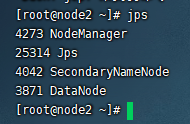

本文基于B站视频教程[2022最新黑马程序员大数据Hadoop入门视频教程，最适合零基础自学的大数据Hadoop教程](https://www.bilibili.com/video/BV1CU4y1N7Sh)，p19-p50，本文软件版本，行文顺序等可能与视频略有不同

<!--more-->

所需安装包等可以关注【黑马程序员】公众号，回复【hadoop】获取

# 一、开始前准备(机器与环境)

## 机器

本机（windows）用来操作，加上三台机器（CentOS7 x64，都要开启SSH）用来搭建集群，分别取名node1、node2、node3，并配置hosts方便连接

本机（windows）打开**C:\Windows\System32\drivers\etc\hosts**文件，并追加以下内容，其中IP地址改为你自己的三台机器，可以不改，但是改了后操作更方便

```ini
###hadoop###
192.168.0.46 node1 node1.ifnxs.cn
192.168.0.49 node2 node2.ifnxs.cn
192.168.0.48 node3 node3.ifnxs.cn
###hadoop-end###
```

## 环境

### 三台机器共同操作：

#### 1. 安装**vim**、**ntpdate**

```shell
yum -y install vim
yum -y install ntpdate
```

#### 2. 关闭防火墙（生产环境请不要这样）

```shell
systemctl stop firewalld.service
systemctl disable firewalld.service
```

#### 3. 配置本机名

```shell
vim /etc/hostname
```

分别改为【node1.ifnxs.cn】、【node2.ifnxs.cn】、【node3.ifnxs.cn】


**配置完建议每台机器都重启一下，不然后面会遇到一个坑**

#### 4. 修改hosts

```shell
vim /etc/hosts
```

追加以下内容，其中IP地址改为你自己的三台机器

```ini
192.168.0.46 node1 node1.ifnxs.cn
192.168.0.49 node2 node2.ifnxs.cn
192.168.0.48 node3 node3.ifnxs.cn
```


#### 5. 同步时间

```shell
ntpdate ntp5.aliyun.com
```

#### 6. 创建统一工作目录

```shell
mkdir -p /export/data # 数据
mkdir -p /export/server # 服务
mkdir -p /export/software # 软件
```

#### 7. node1->node1/node2/node3免密登录

```shell
ssh-keygen # 四个回车
ssh-copy-id node1 # yes 密码
ssh-copy-id node2 # yes 密码
ssh-copy-id node3 # yes 密码
```

#### 8. 安装JDK1.8

##### 8.1 下载jdk-8u311-linux-x64

官方下载链接(需要注册，可能网速慢)：

[https://www.oracle.com/java/technologies/downloads/](https://www.oracle.com/java/technologies/downloads/)


百度网盘：

链接：[https://pan.baidu.com/s/176N837BQXyUoIt7HvF0c0A](https://pan.baidu.com/s/176N837BQXyUoIt7HvF0c0A)
提取码：0ld6

##### 8.2 安装

上传安装包到**/export/server/**，然后解压

```shell
cd /export/server/
tar -zxvf jdk-8u311-linux-x64.tar.gz
```

编辑环境变量

```shell
vim /etc/profile
```

结尾追加

```sh
export JAVA_HOME=/export/server/jdk1.8.0_311
export PATH=$PATH:$JAVA_HOME/bin
export CALSSPATH=.:$JAVA_HOME/lib/dt.jar:$JAVA_HOME/lib/tools.jar
```

拷贝到另外两台机器

```shell
scp -r /export/server/jdk1.8.0_311/ root@node2:/export/server/
scp /etc/profile root@node2:/etc/
scp -r /export/server/jdk1.8.0_311/ root@node3:/export/server/
scp /etc/profile root@node3:/etc/
```

使生效

```shell
source /etc/profile
```

# 二、开始

## (一)、安装配置

### 1. 安装hadoop

复制安装包(本文用的是视频里的安装包)到node1的/export/server/目录下，解压并删除压缩包

```shell
tar -zxvf hadoop-3.3.0-Centos7-64-with-snappy.tar.gz
rm -f hadoop-3.3.0-Centos7-64-with-snappy.tar.gz
```

### 2. 修改配置文件

配置文件操作都在这个目录下

```shell
cd /export/server/hadoop-3.3.0/etc/hadoop/
```

#### 2.1 第1类

##### hadoop-env.sh

```shell
vim hadoop-env.sh
```

在文件结尾追加以下并保存

```sh
export JAVA_HOME=/export/server/jdk1.8.0_311
export HDFS_NAMENODE_USER=root
export HDFS_DATANODE_USER=root
export HDFS_SECONDARYNAMENODE_USER=root
export YARN_RESOURCEMANAGER_USER=root
export YARN_NODEMANAGER_USER=root 
```

#### 2.2 第2类

##### core-site.xml

```shell
vim core-site.xml
```

在**configuration**标签中间添加以下

```xml
<!-- 设置默认使用的文件系统 Hadoop支持file、HDFS、GFS、ali|Amazon云等文件系统 -->
<property>
    <name>fs.defaultFS</name>
    <value>hdfs://node1:8020</value>
</property>

<!-- 设置Hadoop本地保存数据路径 -->
<property>
    <name>hadoop.tmp.dir</name>
    <value>/export/data/hadoop-3.3.0</value>
</property>

<!-- 设置HDFS web UI用户身份 -->
<property>
    <name>hadoop.http.staticuser.user</name>
    <value>root</value>
</property>

<!-- 整合hive 用户代理设置 -->
<property>
    <name>hadoop.proxyuser.root.hosts</name>
    <value>*</value>
</property>

<property>
    <name>hadoop.proxyuser.root.groups</name>
    <value>*</value>
</property>

<!-- 文件系统垃圾桶保存时间 -->
<property>
    <name>fs.trash.interval</name>
    <value>1440</value>
</property>
```

##### hdfs-site.xml

```shell
vim hdfs-site.xml
```

在**configuration**标签中间添加以下

```xml
<!-- 设置SNN进程运行机器位置信息 -->
<property>
    <name>dfs.namenode.secondary.http-address</name>
    <value>node2:9868</value>
</property>
```

##### mapred-site.xml

```shell
vim mapred-site.xml
```

在**configuration**标签中间添加以下

```xml
<!-- 设置MR程序默认运行模式： yarn集群模式 local本地模式 -->
<property>
  <name>mapreduce.framework.name</name>
  <value>yarn</value>
</property>

<!-- MR程序历史服务地址 -->
<property>
  <name>mapreduce.jobhistory.address</name>
  <value>node1:10020</value>
</property>
 
<!-- MR程序历史服务器web端地址 -->
<property>
  <name>mapreduce.jobhistory.webapp.address</name>
  <value>node1:19888</value>
</property>

<property>
  <name>yarn.app.mapreduce.am.env</name>
  <value>HADOOP_MAPRED_HOME=${HADOOP_HOME}</value>
</property>

<property>
  <name>mapreduce.map.env</name>
  <value>HADOOP_MAPRED_HOME=${HADOOP_HOME}</value>
</property>

<property>
  <name>mapreduce.reduce.env</name>
  <value>HADOOP_MAPRED_HOME=${HADOOP_HOME}</value>
</property>
```

##### yarn-site.xml

```shell
vim yarn-site.xml
```

在**configuration**标签中间添加以下

```xml
<!-- 设置YARN集群主角色运行机器位置 -->
<property>
	<name>yarn.resourcemanager.hostname</name>
	<value>node1</value>
</property>

<property>
    <name>yarn.nodemanager.aux-services</name>
    <value>mapreduce_shuffle</value>
</property>

<!-- 是否将对容器实施物理内存限制 -->
<property>
    <name>yarn.nodemanager.pmem-check-enabled</name>
    <value>false</value>
</property>

<!-- 是否将对容器实施虚拟内存限制。 -->
<property>
    <name>yarn.nodemanager.vmem-check-enabled</name>
    <value>false</value>
</property>

<!-- 开启日志聚集 -->
<property>
  <name>yarn.log-aggregation-enable</name>
  <value>true</value>
</property>

<!-- 设置yarn历史服务器地址 -->
<property>
    <name>yarn.log.server.url</name>
    <value>http://node1:19888/jobhistory/logs</value>
</property>

<!-- 历史日志保存的时间 7天 -->
<property>
  <name>yarn.log-aggregation.retain-seconds</name>
  <value>604800</value>
</property>
```

#### 2.3 第3类

##### workers

```shell
vim workers
```

删除原有，添加以下

```
node1.ifnxs.cn
node2.ifnxs.cn
node3.ifnxs.cn
```

### 3. 修改环境变量

```shell
vim /etc/profile
```

结尾追加以下

```shell
export HADOOP_HOME=/export/server/hadoop-3.3.0
export PATH=$PATH:$HADOOP_HOME/bin:$HADOOP_HOME/sbin
```

### 4. 同步到另外两台机器

```shell
cd /export/server
scp -r hadoop-3.3.0 root@node2:$PWD
scp -r hadoop-3.3.0 root@node3:$PWD
scp /etc/profile root@node2:/etc/
scp /etc/profile root@node3:/etc/
```

最后在所有机器执行

```shell
source /etc/profile
```

### 5. 集群启动(node1执行)

#### 5.1 （==首次启动==）格式化namenode

```sh
hdfs namenode -format
```

#### 5.2 脚本一键启动

```shell
start-dfs.sh
start-yarn.sh
```

日志目录**/export/server/hadoop-3.3.0/logs/**

启动成功后

* node1

  

* node2

  

* node3

  

Web  UI页面

- HDFS集群：http://node1:9870/
- YARN集群：http://node1:8088/

这里我遇到了一个坑，应该是配置本机名那一步，配置完没有重启导致的

##### 坑：

**Overview**显示【Live Nodes】有3个，点进去只能看到一个

经过确认，三台机器的【Cluster ID】一样，可能【Cluster ID】是通过主机名生成的，如果是通过一台虚拟机克隆多台也可能遇到这样的坑，解决方法都是一样的

##### 解决：

###### 1、停止服务（node1）

```sh
stop-dfs.sh
stop-yarn.sh
```

###### 2、确认三个主机名不一样（三台）

```sh
cat /etc/hostname
```

###### 3、删除data（三台）

```sh
rm -rf /export/data/hadoop-3.3.0/
```

###### 4、重启机器（三台）

```sh
reboot
```

###### 5、初始化（node1）

```sh
hdfs namenode -format
```

###### 6、启动（node1）

```sh
start-dfs.sh
start-yarn.sh
```


## (二)、使用

### MapReduce体验

计算圆周率

```sh
cd /export/server/hadoop-3.3.0/share/hadoop/mapreduce/
hadoop jar hadoop-mapreduce-examples-3.3.0.jar pi 2 2
```

### HDFS常用命令

#### 1. 创建文件夹

**hadoop fs -mkdir [-p] &#60;path&#62;  ... **

path 为待创建的目录

-p选项的行为与Unix mkdir -p非常相似，它会沿着路径创建父目录

```sh
hadoop fs -mkdir /ifnxs
```

#### 2. 查看指定目录下内容

**hadoop fs -ls [-h] [-R] [&#60;path&#62; ...]**

path 指定目录路径

-h 人性化显示文件size

-R 递归查看指定目录及其子目录

```sh
hadoop fs -ls -h /
```

#### 3. 上传文件到HDFS指定目录下

**hadoop fs -put [-f] [-p]  &#60;localsrc&#62; ... &#60;dst&#62;**

-f 覆盖目标文件（已存在下）

-p 保留访问和修改时间，所有权和权限

localsrc 本地文件系统（客户端所在机器）

dst 目标文件系统（HDFS）

```sh
echo 1 > 1.txt
hadoop fs -put 1.txt /ifnxs
```

#### 4. 查看HDFS文件内容

**hadoop fs -cat  &#60;src&#62;  ...**

读取指定文件全部内容，显示在标准输出控制台

注意：对于大文件内容读取，慎重

```sh
hadoop fs -cat /ifnxs/1.txt
```

#### 5. 下载HDFS文件

**hadoop fs -get [-f] [-p]   &#60;src&#62; ... &#60;localdst&#62;**

下载文件到本地文件系统指定目录，localdst必须是目录

-f 覆盖目标文件（已存在下）

-p 保留访问和修改时间，所有权和权限

```sh
hadoop fs -get /ifnxs/1.txt ./2.txt
```

#### 6. 拷贝HDFS文件

**hadoop fs -cp [-f] &#60;src&#62; ... &#60;dst&#62; **

-f 覆盖目标文件（已存在下）

```sh
hadoop fs -cp /ifnxs/1.txt /ifnxs/3.txt
```

#### 7. 追加数据到HDFS文件中

**hadoop fs -appendToFile  &#60;localsrc&#62; ... &#60;dst&#62;**

将所有给定本地文件的内容追加到给定dst文件

dst如果文件不存在，将创建该文件

如果&#60;localSrc&#62;为-，则输入为从标准输入中读取

```sh
hadoop fs -appendToFile 1.txt 2.txt /ifnxs/1.txt
```

#### 8. HDFS数据移动操作

**hadoop fs -mv &#60;src&#62; ... &#60;dst&#62; **

移动文件到指定文件夹下

可以使用该命令移动数据，重命名文件的名称

```sh
hadoop fs -mv /ifnxs/1.txt /ifnxs/333.txt
```

[其他命令](https://hadoop.apache.org/docs/r3.3.0/hadoop-project-dist/hadoop-common/FileSystemShell.html)

