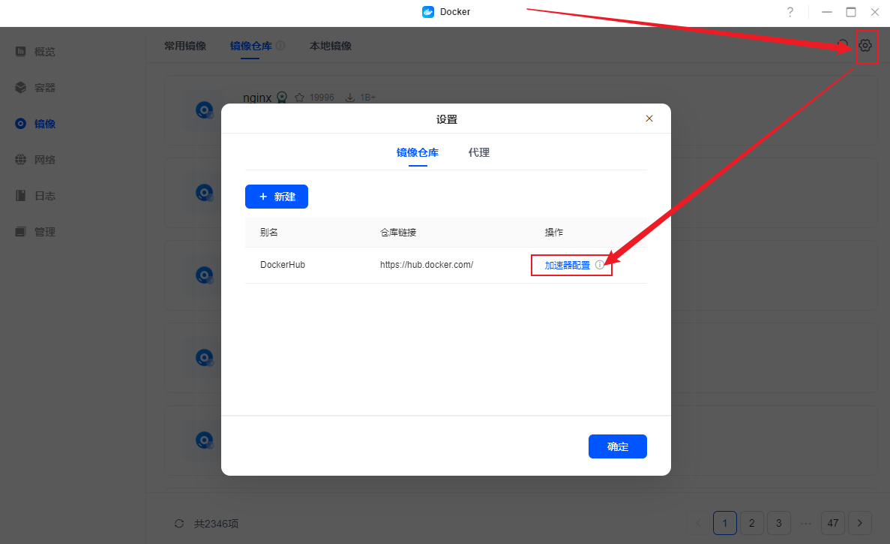
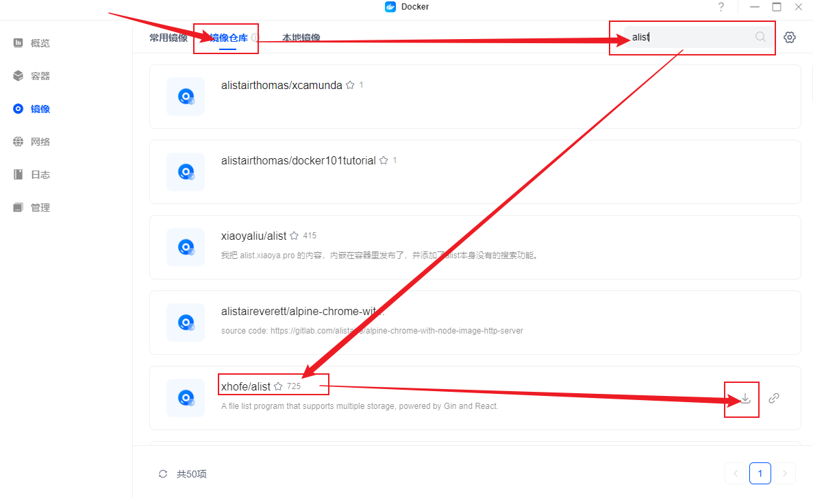
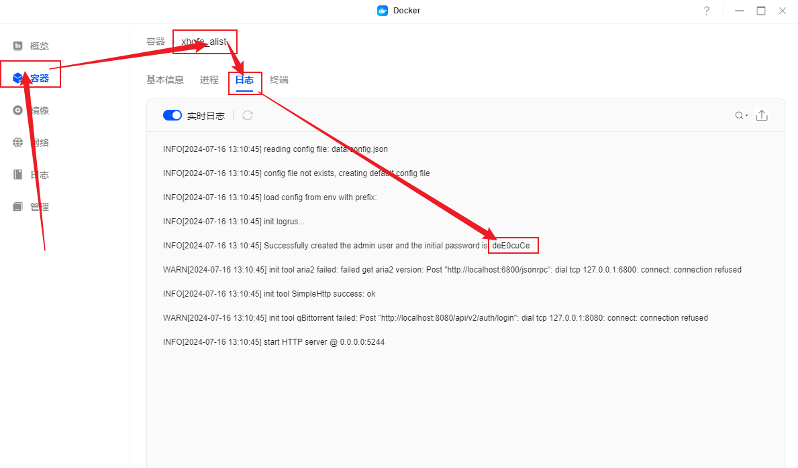
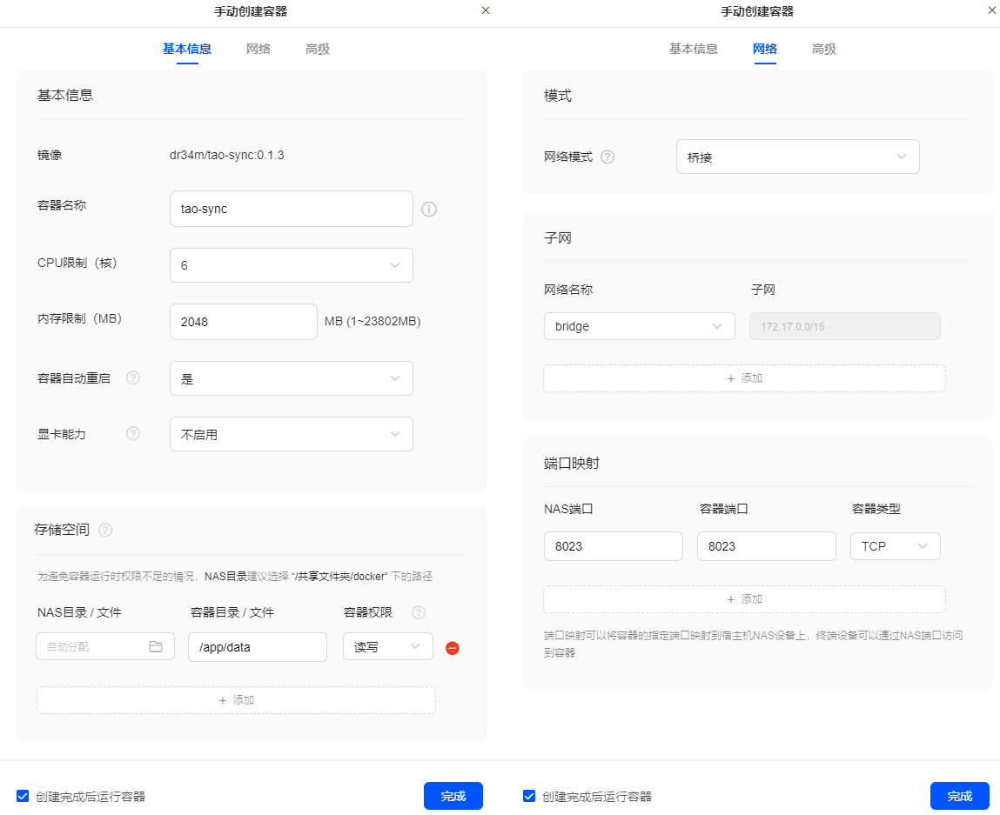
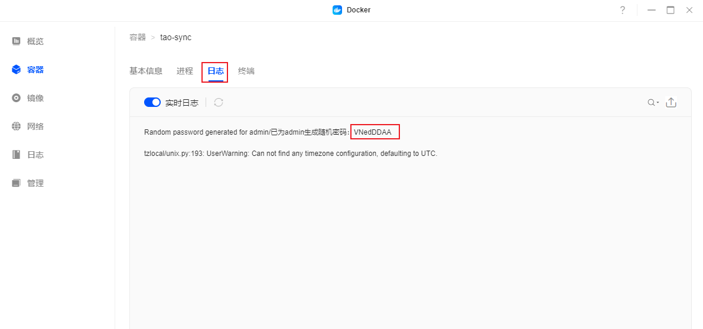

# 目标

在绿联NAS中使用[TaoSync](https://github.com/dr34-m/taosync)自动定时同步我的文件到各个网盘。

<!--more-->

**如果好用欢迎Star：[https://github.com/dr34-m/taosync](https://github.com/dr34-m/taosync)，非常感谢！**

TaoSync基于[AList](https://alist.nn.ci/zh/)实现自动同步功能，可以实现以下不同网盘或存储之间的自动定时同步。

- 本地存储
- [阿里云盘](https://www.alipan.com/)
- OneDrive / Sharepoint（[国际版](https://www.office.com/), [世纪互联](https://portal.partner.microsoftonline.cn),de,us）
-  [天翼云盘](https://cloud.189.cn) (个人云, 家庭云)
- [GoogleDrive](https://drive.google.com/)
- [123云盘](https://www.123pan.com/)
- FTP / SFTP
- [PikPak](https://www.mypikpak.com/)
- [S3](https://aws.amazon.com/cn/s3/)
- [Seafile](https://seafile.com/)
- [又拍云对象存储](https://www.upyun.com/products/file-storage)
- WebDav(支持无API的OneDrive/SharePoint)
- Teambition（[中国](https://www.teambition.com/ )，[国际](https://us.teambition.com/ )）
- [分秒帧](https://www.mediatrack.cn/)
- [和彩云](https://yun.139.com/) (个人云, 家庭云)
- [Yandex.Disk](https://disk.yandex.com/)
- [百度网盘](http://pan.baidu.com/)
- [UC网盘](https://drive.uc.cn)
- [夸克网盘](https://pan.quark.cn)
- [迅雷网盘](https://pan.xunlei.com)
- [蓝奏云](https://www.lanzou.com/)
- [蓝奏云优享版](https://www.ilanzou.com/)
- [阿里云盘分享](https://www.alipan.com/)
- [谷歌相册](https://photos.google.com/)
- [Mega.nz](https://mega.nz)
- [一刻相册](https://photo.baidu.com/)
- SMB
- [115](https://115.com/)
- Cloudreve
- [Dropbox](https://www.dropbox.com/)
- [飞机盘](https://www.feijipan.com/)
- [多吉云](https://www.dogecloud.com/product/oss)

# 实现

由于国内Docker镜像被墙，各大加速镜像站也不可用，需要你自行解决这个问题。目前可以通过在加速器URL中添加下边的链接实现，但随着时间的推移此链接可能随时失效。

```
https://docker.hlyun.org
```



## 一、AList安装

镜像仓库搜索`alist`，找到下边的下载



到镜像页面确认其下载完成后，点击后边的新建，参考配置如下


创建之后，点击左侧容器菜单，找到创建的容器点击名字进去，点开日志可以看到密码



通过下边的地址即可访问，输入账号`admin`，密码上边获取的，进去后点下边的管理，点左侧存储，点添加，然后按照[官方文档](https://alist.nn.ci/zh/guide/drivers/)添加存储


如果要添加本地存储，建议可以通过smb的方式添加，地址为NAS的IP地址，例如我是`192.168.31.2`，用户名密码就是你绿联的用户名密码，分享名称如果是个人文件夹是`personal_folder`，更多可以在电脑地址栏输入`\\192.168.x.x`查看，如下图


## 二、TaoSync安装

镜像仓库搜索`tao-sync`，找到下边的下载


下载完成后在镜像仓库点新建，可以参考下边的配置



点开容器在日志中可以看到admin的密码



通过下边的地址访问后，输入用户名admin以及上边的密码进入

> 如果日志中没有输出密码，也可以到挂载路径的/log/sys_xxxx.log文件查看密码，通常在第一行
>
> 或者进入docker命令行，cd /app/data/log/，然后ls获取到文件名，cat sys_xxxx.log查看


然后创建引擎，输入AList地址(例如我的是`http://192.168.31.2:5244`，请改为你自己的)、账号与密码（注意是AList的，不是TaoSync的）


然后可以进入作业管理新建作业啦，先选择引擎，然后选择你要备份的目录（来源目录），与你想要备份到哪里（目标目录，可以选择多个），点击确定，备份即可开始！


你可以随时点进作业详情查看进度，如果文件较多较大，可能会很耗时间，建议刚开始不要操作以免加重负担