# 前言

之前有在虚拟机通过翻墙搭建了FBCTF平台，但是毕竟是虚拟机搭建的，只能在校园里网内使用，要让外网访问就需要做内网穿透了，麻烦而且不稳定，于是就想要在云服务器上搭建，由于开始思路就很正确，一次就成功了，具体方法如下：

# 准备工作
<!--more-->
一、既然是在云服务器上搭建平台，首先自然得有一台腾讯云服务器，如果你的云服务器在国外，第二条就不用看了；
二、如果你的云服务器在国内的话，由于FBCTF的一个重要组件HHVM在墙外，所以首先需要准备一个墙外的服务器，必须选香港的！因为只有香港的才能复制镜像。不要包月了，没必要，直接按量计费，挑个2核4G100M的配置，整个计费过程不会花超过3块钱（除非你耗时太长），详细如下：
打开腾讯云官网注册账号并登录，点击如下位置选购服务器：
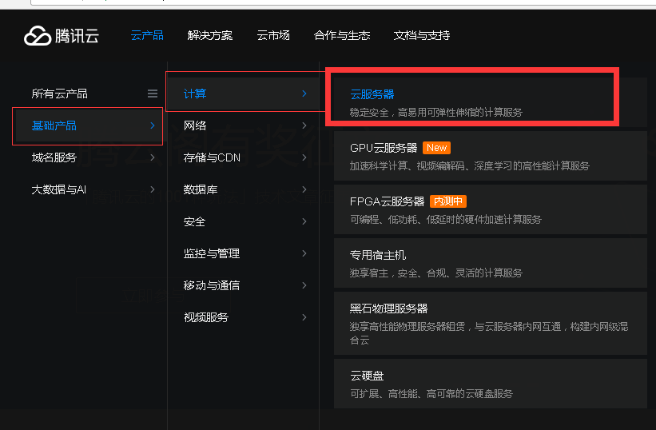
进入后后点击立即选购，然后选择配置，推荐如图：
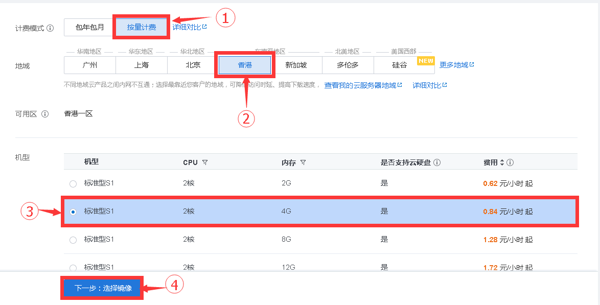
继续选择镜像，注意必须选择如图：
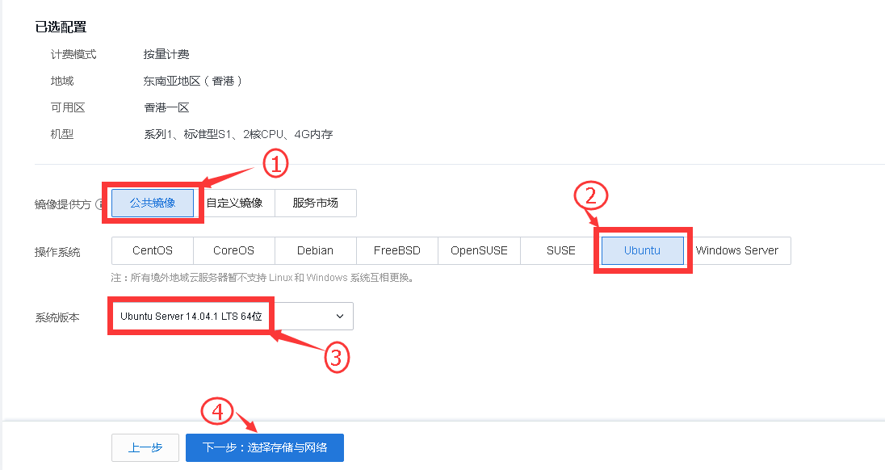
继续选择网络，反正按量计费，任性如图：

之后选择安全组，默认全部放通即可，如图：

之后点击开通并等待它创建完成即可，通常1min之内创建完成。
三、如果需要下载汉化版，可以[点击这里下载](https://blog.ctftools.com/2017/03/post106)

# 开始安装

一、下载putty（一款用于linux远程连接的软件），打开后输入公网IP如图操作：
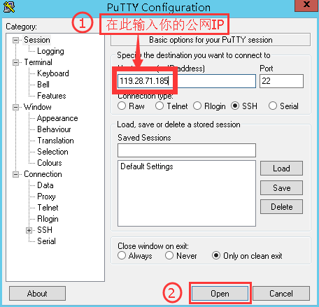
之后在可能弹出的对话框里点确定，然后在弹出的黑底白字的界面依次输入你的服务器账号和密码（注意输入密码时不会显示，不要担心是自己没输入），得到如图：
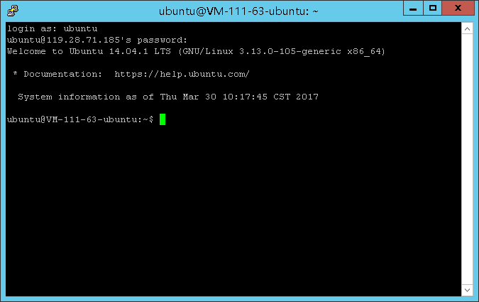
二、输入（在putty里边选中就是复制，右键是粘贴)代码

```
sudo apt-get install git
```
然后敲击回车来安装git，中间会提示你是否安装，输入y后再敲击回车；
三、输入代码
```
git clone https://github.com/facebook/fbctf
```
让服务器从GitHub拷贝fbctf源码到服务器；
四、下载FileZilla Client（一款FTP软件）并打开，点击左上角文件-站点管理器-新站点，然后如图操作，注意公网IP改为自己的：
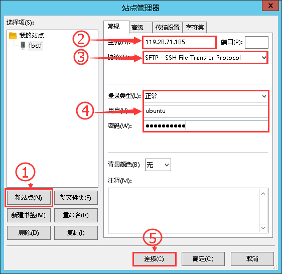
之后就可以列出服务器目录如图：
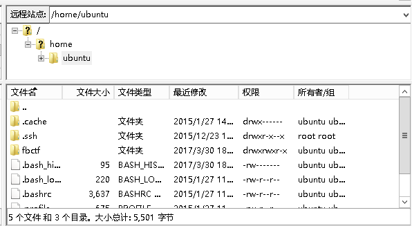
之后依次打开`fbctf/src/language`，删除掉其中的`lang_zh-tw.php`，[点击这里下载汉化版](https://blog.ctftools.com/2017/03/post106)，解压并上传到该目录下，方法为从左边本地目录找到解压后的`lang_zh-cn.php`，拖到右边即可，如图：

五、打开putty输入代码cd fbctf敲击回车，再输入代码

```
./extra/provision.sh -m prod -c self -s $PWD
```
就可以开始安装了，如图：
开始：
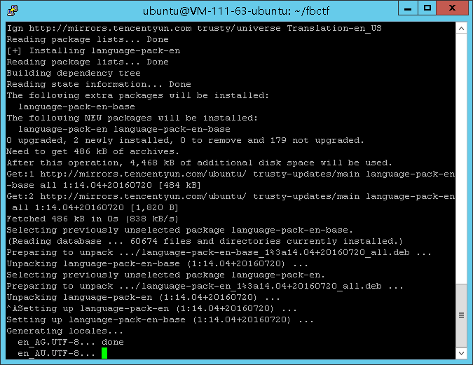
约5min后：
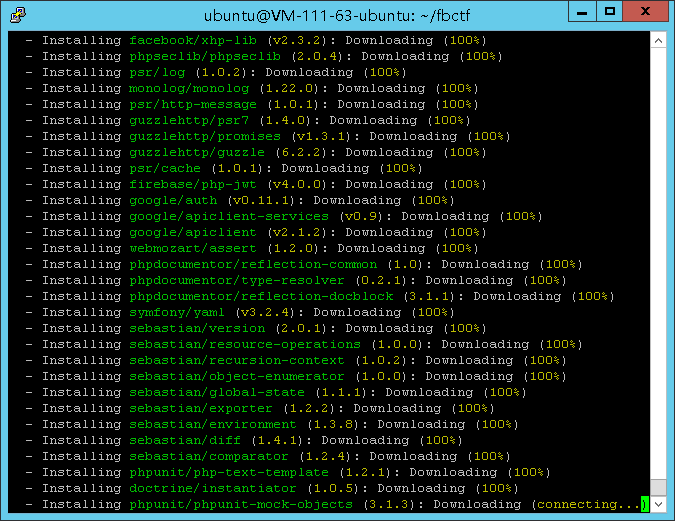
约10min后：
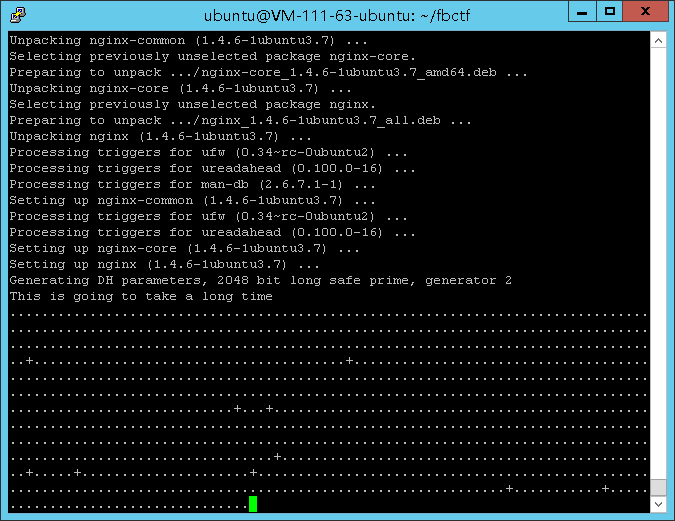
约13min后安装完成，并打印出密码，务必记下（在putty里边选中就是复制，右键是粘贴)，如图：
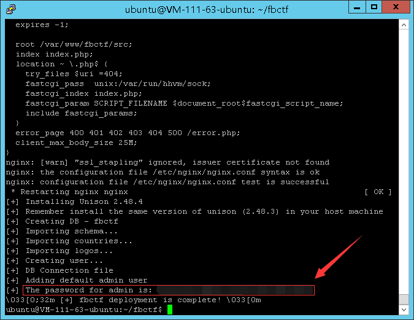

# 后续工作

一、之后会有SSL证书问题，编辑`/etc/nginx/sites-available/fbctf.conf`这个文件即可，详细就不多说了，我的方法是在腾讯云申请SSL证书，然后下载并解压出nginx对应版本上传到`/home/ubuntu/ssl`目录下，然后编辑`/etc/nginx/sites-available/fbctf.conf`
将证书目录修改为实际目录即可，注意修改这个文件需要root权限！
二、如果安装完之后想要修改源文件需要重新编译才能生效，可以参考[HBCTF博客](https://blog.ctftools.com/2017/03/post106)。
三、一切准备好之后就进入控制台把服务器关机，然后制作镜像，如图：
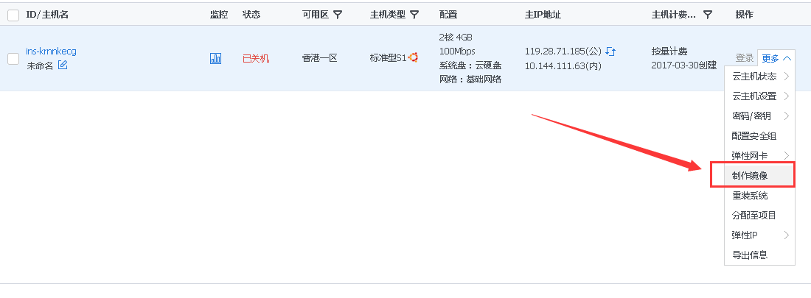
**制作完镜像记得销毁服务器以免产生不必要的费用**
四、将镜像跨地域复制到你的国内服务器所在区域，如图：

有时候一次不成功，需要多试几次，或者换个区域。
五、在国内的服务器上重装系统，在选择镜像时选择自定义镜像，然后就能看到你做好的镜像了

# 至此完成，感谢阅读！