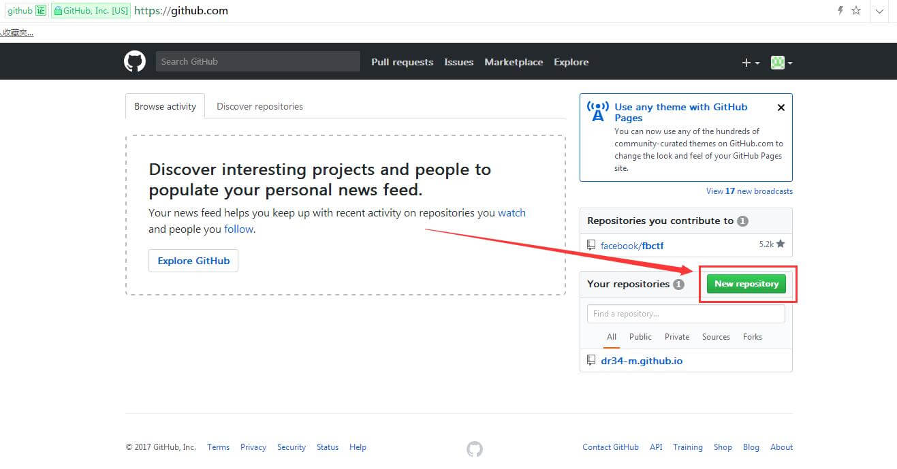
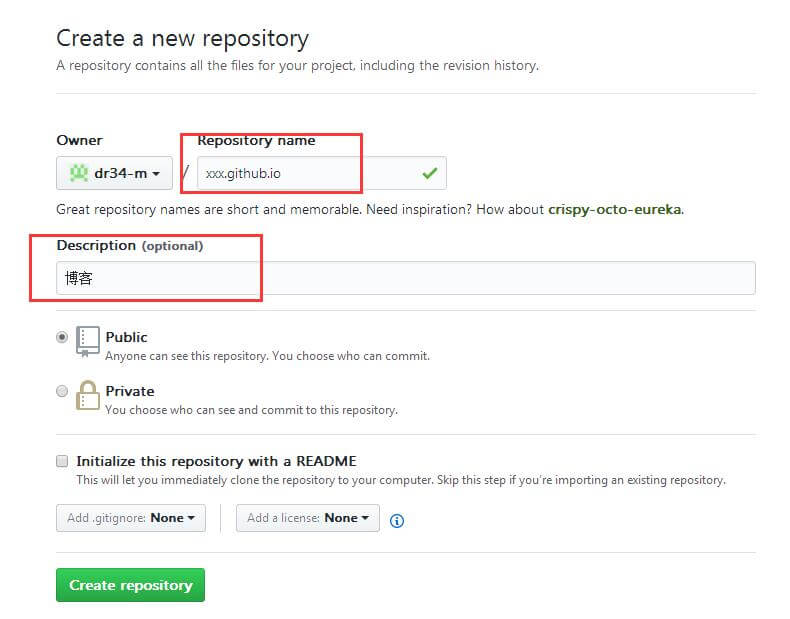
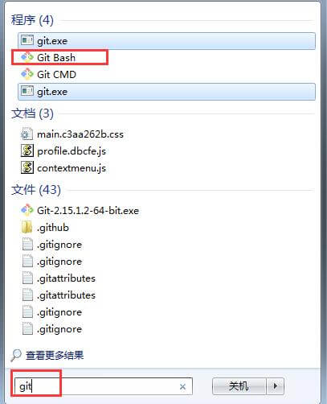
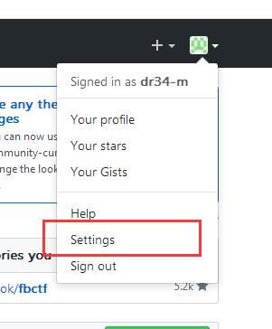
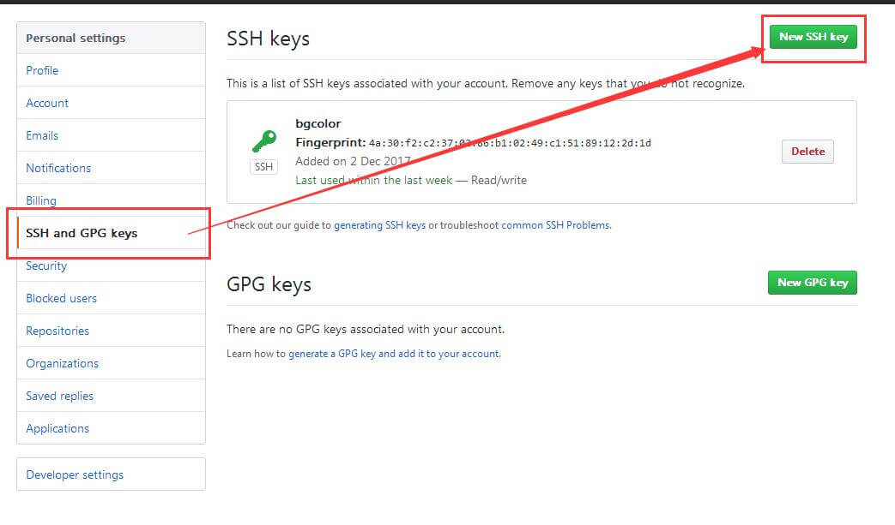

所有可能用到的工具或者文件都放在百度网盘：链接：[https://pan.baidu.com/s/1mhLRnk8](https://pan.baidu.com/s/1mhLRnk8) 提取密码：7ott
### 一、安装Hexo到本地

#### 1.安装Git

1.1从[官网](https://git-scm.com/download/win)或者上边提供的百度网盘下载Git安装包，由于众所周知的原因，官网下载十分缓慢。下载完安装即可，中间会让你选择默认编辑器，如果不习惯Vim推荐Notepad++作为默认编辑器，如图
<!--more-->


其他保持默认即可。

#### 2.安装Node.js

2.1从[官网](https://nodejs.org/zh-cn/)或者上边提供的百度网盘下载Node.js安装包。下载完安装即可，如果没有特别需求安装选项全部保持默认。

#### 3.安装Hexo

3.1使用Win+R打开运行，输入`cmd`，打开命令提示符，然后输入
```sh
npm install -g hexo-cli
```
大概几十秒到2分钟后即可安装完成

3.2安装 Hexo 完成后，请执行下列命令，Hexo 将会在指定文件夹中新建所需要的文件。下边以放在D盘的hexo文件夹下为例
```sh
hexo init D:\hexo
D:
cd hexo && npm install
```
大概几十秒到2分钟后即可安装完成，此时D:\hexo文件夹的目录树如下
```
├── _config.yml
├── package.json
├── scaffolds
├── source
|   ├── _drafts
|   └── _posts
└── themes
```

#### 4.配置hexo

4.1用Notepad++或者其他编辑器打开_config.yml文件

多数设置保持默认即可，一般需要改动的有如下几项：
```sh
title: #网站名称
subtitle: #副标题
description: #网站描述，主要用于SEO
author: #作者
language: #语言，中文填写'zh-cn'，没有引号
timezone: #网站时区。Hexo 默认使用您电脑的时区。中国可以填写'Asia/Shanghai'，没有引号
url: #你的网址，可以先不改动
theme: #主题选择
```
详细配置可以参照[Hexo官方文档](https://hexo.io/zh-cn/docs/configuration.html)

4.2你可以到网络上下载主题，比如[官网主题](https://hexo.io/themes/)，下载完解压到`~\hexo\themes`目录下的一个文件夹里，然后在`_config.yml`里边的`theme: `后填写文件夹名即可应用主题

#### 5.新建博文

5.1首先在cmd切换到你的hexo目录，可以在资源管理器打开hexo所在目录，然后在地址栏输入`cmd`然后敲击回车，很方便

5.2cmd里边输入
```sh
hexo new post001
```
就能在`~hexo\source\_posts`目录下生成post001.md文件，文件名可以自定义，编辑该文件写博文，语法可以参照[Markdown新手指南](http://www.jianshu.com/p/q81RER)，或者[下载当前博文的.md文件](https://other-1252906577.costj.myqcloud.com/doc/post233.md)以作参考

#### 6.生成静态文件并预览

配置好hexo和主题并编辑完文章之后，可以通过
```sh
hexo g
```
生成静态文件到public文件夹，你可以复制该文件夹下所有文件到你的网站目录来发布你的博客到网络

可以通过以下命令
```sh
hexo s
```
默认情况下在浏览器访问`http://localhost:4000/`预览你的博客

### 二、托管hexo博客到github

#### 1.注册github账号并创建Repository

1.1注册账号就不多说了，登陆之后点击`new repository`，如图

然后编辑名称为xxx.github.io，xxx为你的用户名，可以添加一些描述，如图

完成之后点击`Create repository`

#### 2.本地与github建立安全联系

2.1生成ssh key

2.1.1如图，打开Git Bash


2.1.2创建.ssh文件夹
```sh
mkdir ~/.ssh
```
2.1.3配置全局的name和email，把下边命令里边的`xxxx`换成你github的用户名，`xxxx@xxx.com`换成你github的注册邮箱
```sh
git config --global user.name "xxxx"  
git config --global user.email "xxxx@xxx.com"
```
2.1.4生成key
```sh
ssh-keygen -t rsa -C "xxxx@xxx.com"
```
输完命令后敲击三次回车，设置的密码为空，生成key成功

2.1.5打开`C:\用户\你的用户名`目录进入.ssh文件夹，用Notepad++或者其他编辑器打开id_rsa.pub，复制里面的内容添加到你github或者bitbucket ssh设置里即可，如下图




标题随意填写

#### 3.部署博客到github

3.1为 Hexo 安装 Git 插件
```sh
npm install hexo-deployer-git --save
```

3.2修改你的 _config.yml 配置文件如下
```sh
# Deployment
## Docs: https://hexo.io/docs/deployment.html
deploy:
  type:git
  repo: git@github.com:xxxx/xxxx.github.io.git
  branch: master
```
注意修改其中的repo为你自己github的ssh地址

3.3在cmd切换到hexo目录下输入
```sh
hexo clean && hexo g -d
```
即可完成部署，然后访问xxx.github.io就能访问你的博客了

3.4如果想使用自己的域名，只需要把域名CNAME解析到xxx.github.io，然后在`~\hexo\source`目录中创建文件`CNAME`（没有后缀名）,文件里填上你的自定义域名（没有`http://`或者`https://`）然后执行一遍
```sh
hexo clean && hexo g -d
```
即可，以后发布新文章或者有其他改动，都可以用上边的命令完成更新，或者用下边的命令在本地预览，前提是cmd切换到了hexo目录
```sh
hexo clean && hexo g && hexo s
```

本文参考资料：[Hexo官方文档](https://hexo.io/zh-cn/docs/)，[Hexo博客部署到github](https://www.cnblogs.com/imapla/p/5533000.html)，[win 7下git ssh创建key](http://blog.csdn.net/lsyz0021/article/details/52064829)