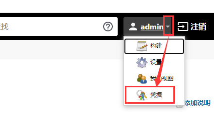
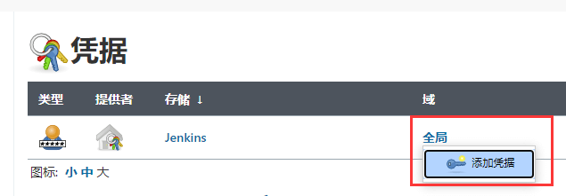
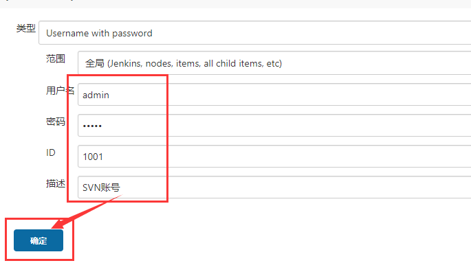
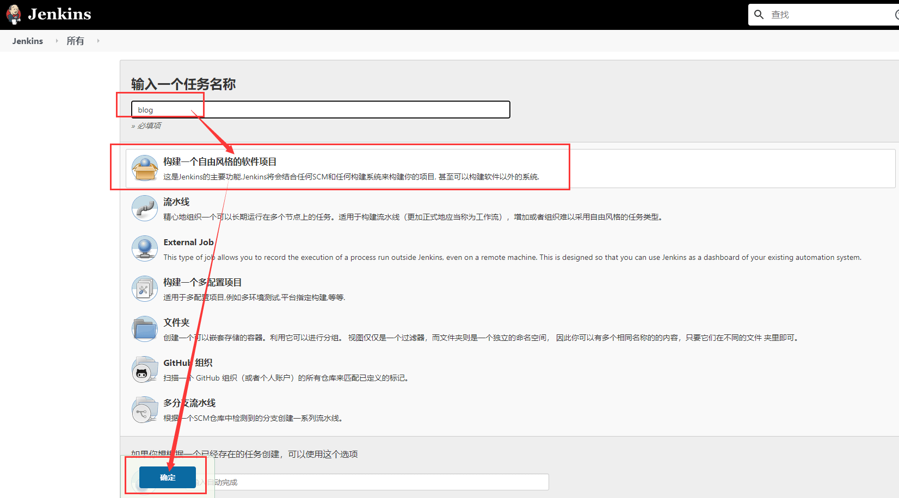
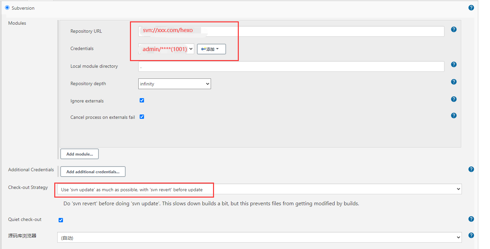

起由：hexo是一个很好用的轻量级博客系统，生成纯静态相对安全而且高性能，但是每次写完博文都需要手动生成静态文件，部署到服务器，影响生活，于是就考虑使用jenkins实现自动部署。

<!--more-->

### 如果希望通过github的actions来实现，可以参考[Hexo + Github Actions 实现提交代码自动部署并通过FTP传到云服务器](https://blog.ctftools.com/2021/07/newpost-18/)

## 一、前提

会用[hexo](/2017/12/post233/)、[svn](/2020/11/post246/)，拥有自己的服务器，安装好[jenkins](/2020/11/post247/)，并把hexo目录中文件同步到svn，其中`db.json`、`public/`、`node_modules/`无需上传，本文假设你已经把它上传到`svn://xxx.cn/hexo`，svn账号密码都为`admin`。

## 二、准备

### 1.系统安装[node.js](https://nodejs.org/zh-cn/download/)

```bash
cd /home
mkdir node
cd /node
wget https://nodejs.org/dist/v14.15.0/node-v14.15.0-linux-x64.tar.xz
tar -xf node-v14.15.0-linux-x64.tar.xz
cd node-v14.15.0-linux-x64
ln -s /home/node/node-v14.15.0-linux-x64/bin/node /usr/local/bin/
ln -s /home/node/node-v14.15.0-linux-x64/bin/npm /usr/local/bin/
```

### 2.安装hexo

```shell
npm install hexo-cli -g
```

### 3.配置环境变量

参考[这篇博文](/2020/11/post248/)

## 三、jenkins配置

* 登录到jenkins，进入系统管理-插件管理，点击可选插件，搜索SVN，找到[SVN 1.4 Compatibility Plugin](https://plugins.jenkins.io/svncompat14)并安装。

* 点击右上角用户的下拉，点击凭据，如图

  

* 点击域-全局下拉-添加凭据，如图

  

* 输入SVN账号，密码，ID(自己造)和描述，点击确定，如图

  

* 进入jenkins首页，左上角新建任务，输入任务名，选择构建自由风格项目，点击确定，如图



* 确定后会进入配置页面，输入描述，例如hexo自动构建，勾选`丢弃旧的构建`，`保持构建的最大个数`建议输入10，`源码管理`选`Subversion`，然后输入svn地址、选择svn账号，如图



* `构建`中点击`增加构建步骤`，点击`执行shell`，命令如下

  ```bash
  #!/bin/bash
  rm -rf ./hexo.zip #如果不需要归档，则删除此行
  npm install --unsafe-perm
  hexo clean
  hexo g
  cd public #如果不需要归档，则删除此行
  zip -r ../hexo.zip ./* #如果不需要归档，则删除此行
  ```

* （可选归档）`构建后操作`中`增加构建后操作步骤`，点击`归档成品`，`用于存档的文件`输入`hexo.zip`。

* 保存后进入刚创建的任务，点击`立即构建`，进入`构建历史`中找到正在构建的任务，点进去查看`控制台输出`，如果最后返回`Finished: SUCCESS`则说明构建成功。

* 构建的`控制台输出`开头会告诉你构建位置，如图，可知构建在`/var/lib/jenkins/workspace/blog`


* 将nginx指向`/var/lib/jenkins/workspace/blog/public`，打开nginx中配置的链接即可访问博客。